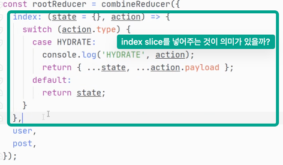

# 강의 노트

이 노트는 모든 강의를 요약하는 것이 아닌 수강 중에 내가 새로 알게 된 내용들을 중심으로 정리를 한다. 


## 2022-04-27

learn 폴더를 만들고 수강 시작

인프런의 노드 강좌는 node 14, next 9, ant 4 버전으로 작업했으나, 나는 node 16, next 12 으로 따라갈 계획이다. 그리고, typescript를 사용한다.

```
npm init
npm i next
npm install --save-dev typescript @types/react @types/node
npm run dev
```

어랏 react를 설치 안 해도 실행이 되는 것을 확인할 수 있다. 재밌는 건 위에서 보면 @types는 설치했다는 거다. 일단 진행하면서 어떤 에러가 나는지 봐야겠다.

pages 폴더 아래 다른 tsx 파일을 만들고 테스트를 해 보니 라우팅이 잘 된다. :-)

FC 타입으로 functional component를 설정하면 children을 바로 사용할 수 있었다.(React 18 이전..)
(Remove React.FC from Typescript template)[https://github.com/facebook/create-react-app/pull/8177]
React 18 이후에는 제거되었으므로 사용할 필요가 없다.

## 2022-04-27 2차

ant design, ant design icon, @emotion/react, @emotion/styled 를 사용한다. (강좌에서는 ant design과 styled-component를 사용하였다.)

ant design이 4.20으로 넘어오면서 Menu 사용법이 조금 바뀌었다.

## 2022-05-02 3차

jsx-ally 로 typo 낸 것을 a11y 로 수정

lerna로 설정하지 않고 루트에서 시작하여 eslint 가 정상동작하지 않음. 이에 intellij를 learn 폴더에서 직접 열어서 사용하고, git에 intellij 프로젝트 설정을 푸시함.

nextjs 에서 _app.tsx 의 Props를 받을 때는 AppProps를 받으면 편하다.

```tsx
const NodeBird = ({Component, pageProps}: AppProps) => {
  return (
    <Component {...pageProps} />
  )
}
```

a tag에서 `rel="noopener noreferer"`의 사용 관련하여
(rel 속성 - noreferrer, noopener, nofollow)[https://3rabbitz.com/blog_ko/08d34c69855fbcad]
(Everything You Need to Know About rel=”noopener noreferrer”)[https://clever-solution.com/everything-you-need-to-know-about-rel-noopener-noreferrer-tags-purpose-benefits-and-seo-impact/]

## 2022-05-02 4차

react-hook-form을 도입하여 Form 작업을 한다.

인라인 스타일에 object를 사용하면 rerendering이 발생한다. 왜냐하면 object를 function이 실행될 때마다 새로 만들어지기 때문이다.
하지만 인라인 스타일이 rerendering에 심각한 영향을 미치지 않을 수 있으므로 너무 과도하지만 않으면 크게 문제는 없다.

@emotion css 스타일을 사용하려면 `tsconfig.json`의 `compilerOptions`부분에 다음을 추가한다.

```json lines
"jsx": "react-jsx",
"jsxImportSource": "@emotion/react"
```

## 2022-05-04 5차

redux 를 사용해서 따라한다.

`zustand`를 한 번 사용해보려고 했는데, 해당 강의가 `redux-saga`, `thunk` 등과 물려 있어 일단은 강의에서 사용하는 redux 를 따라한다.

next에서 redux를 사용하는 경우 server side rendering 등 기능과의 원활한 소통을 위해 `next-redux-wrapper`를 사용한다.

## 2022-05-08 6차

next-redux-wrapper 의 기본 설정을 redux toolkit 과 조합하여 설정하였다. 

SSR 특성으로 인해 서버 사이드에서 생성한 store의 상태값을 reducer 에서 항상 머지를 해 줘야 한다. 이 특수한 목적으로 HYDRATE action을 제공하고 있다.

## 2022-05-10 7차

> redux를 SSR로 사용할 때 문제가 있을 수 있다는 것을 이해하지 못하겠다. 어떻게 쓰는지도.... 며칠을 이것 관련해서 살펴봤는데 이해가 안 간다. SSG, SSR의 경우 client의 상태를 알 수 없고, 생성 시점에 store를 새로 생성해야 하므로 state를 유지하지 못한다는 것은 이해를 했는데, next-redux-wrapper를 쓴다고 해서 client의 상태를 서버에서 알 수 있을 것 같지도 않다. 특히 SSG의 경우 build time에 store를 생성하는데 이게 무슨 의미가 있는지 모르겠다. 만약 SSG 페이지가 여러 개이고 각각 store를 생성하고 여러 action을 dispatch해 버리면, state가 꼬일텐데 이건 store 복구의 이슈가 아니라 그냥 그 자체로 상태 관리의 문제가 되는 것 아닌가? store라는 것이 app의 상태이고 app의 상태라는 것은 client의 상태랑 동일하다고 봐도 되지 않을까? 물론 global state라고 한다면 client + server 이겠으나. SSG, SSR을 적용할 때 상태에 의존한다는 것 자체가 모순 아닐까?



> 며칠째 redux와 SSR/SSG 때문에 관련자료를 검색해 보고 이해해 보려 했지만 위와 같이 정리가 되지 않는다. 이런 이유로 오늘도 결국 셋업만 하고 끝난 듯... 
 
## 2022-05-11 8차

... 아무것도 안 했네.. 설정만 하다 끝...

## 2022-05-12 9차

react-hook-form에서 input 필드의 ref를 외부에서 참조할 때는 register 또는 field 에서 ref 인자를 받고, 이를 직접 넣어 주어야 한다. 

```jsx
ref={(e) => {
  ref(e)
  uploadInput.current = e
}}
```
